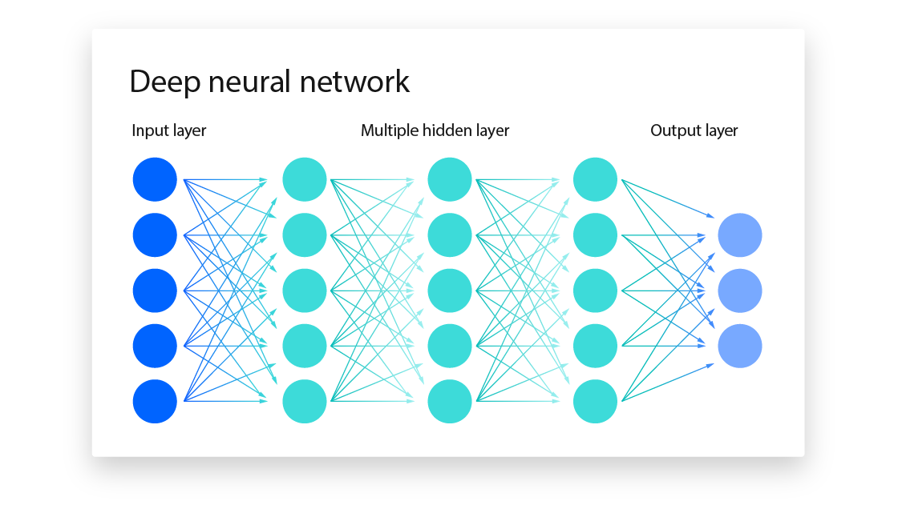

I always try to be on the forefront of tech, but now with AI, I have never feel less behind in my life and career than ever. I have "learned" AI in the past during my undergraduate, mostly classical ML algorithm. Really it's just implementation and never a deep dive into the math and the why. In this age, I don't want to be just the guy that implements API, everybody can do that. It doesn't give me an edge, I really need to understand the why. Maybe if im good enough, I can even contribute to this field.

This post will be my first blog post where I post my journey learning AI. I will start by reading from what I heard a lot of people called [bible of deep learning](https://www.deeplearningbook.org/) by Ian Goodfellow, Yoshua Bengio, and Aaron Courville. This blog will hopefully be my way of being accountable to myself and engaging myself in active learning. Without further ado, lets rideeeee  🥜.

## The basics

I always just accepted that _deep learning_ is like a more advance _machine learning_. Based on the book, deep learning is

> If we draw a graph showing how these concepts are built on top of each other, the graph is deep, with many layers. For this reason,we call this approach to AI deep learning. (Chapter 1 - Page 2)

and the definition of maching learning is 

> ...extracting patterns from raw data. This capability is known as machine learning (Introduction - Page 2)

When I ask LLM, about definition of deep learning based on the text from the book, it correlates it with neural network and how it has many layers. But really, its multiple layer of concept that creates a deep graph, where each graph holds different concepts and how they are connected to each other. This makes sense, I think. If you visualize a neural network:

_Photo from [IBM blog](https://www.ibm.com/think/topics/neural-networks)_

I am guessing that each layer holds a different concept, and the information that is passed from the beginning to the end would go through these concepts to come up with some conclusion (or inference). I never thought of these layers like that, I just thought of them as weights, but really, i don't even know what weights are!

On the other hand, I think the definition of ML is pretty straight forward. Like a simple regression or clustering algorithm. Those are all stemming from raw data, and after we implment those algorithm, we can extract insights from them.


Ok, this is going to be out of topic. I didn't know they used naive bayes to separate spam and ham (non-span) emails. The reason why I mentioned this is because they mentioned it in the book. I think that is interesting. I asked Gemini to break this down for me, and basically it calculates the probability of words that appear in a spam and ham emails from a training dataset. If a new email comes in and have a lot of words that is from the spam email, then it classified it as spam emails.

This might be some little project that I would be interested in following up, and even try to break. If so (hopefully so), I would post the blog post and github here. I am sure there are way more advance way of detecting spam nowadays and this problem has been solved. But I am just curious.


---

Ok, so this is something that I expect while learning all this from scratch...

Gif taken from [Giphy](https://media.giphy.com/media/v1.Y2lkPTc5MGI3NjExdGdtMHhxMHdjMzlmMXBndTIybDN2OXppZ3pyZmdrdnl1aHFkZ21nMiZlcD12MV9naWZzX3NlYXJjaCZjdD1n/VbnUQpnihPSIgIXuZv/giphy.gif)

There are just SOO much information to take in, and even reading 4 pages (which is how much I just read) is a lot. Most of my time is spent re-reading and looking up things. Honestly, LLM came in really clutch here as I can just ask it anything and it most likely gave me the right answer instantly, without me needing to look for information from other sources.

Currently, I left off on representation learning, I feel I need to dig more on it. Later in the text it mentions about autoencoder (both encoder and decoder), which is something I often heard in this LLM era. I think it is worth doing a bit more of a background understanding on representaion learning and autoencoder before I move forward. Not to understand how it works, but to just understand more of what they do and their importance.

Honestly, on this first day (step) on this long journey, I just did a refresher on what DL and ML are, found out an interesting implementation of Naive Bayes, and polar coordinates. As someone who is learning from the bottom here, there is a lot to unpack and getting overwhelemed is the last thing I need. So I am going to take it slow and pick it up again later.

This "blog" is sounding more and more like a journal...